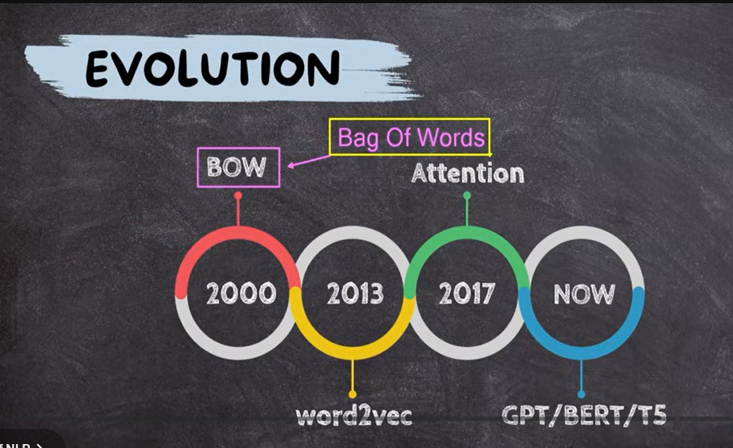

# Session 1

## Youtube Video 
  [Generative AI Full Course For Beginners (Data Domain Edition)](https://www.youtube.com/watch?v=9wNJ3IOfkHg)

-----------------------------

- What is AI?
Artificial intelligence (AI) is technology that enables computers and machines to simulate human-like abilities such as learning, reasoning, problem-solving, and decision-making.

- Language AI?  
Language AI refers to artificial intelligence systems focused on understanding, processing, and generating human language. It's a subset of AI often powered by natural language processing (NLP) and large language models (LLMs) like those behind chatbots and translation tools

- Evoluation AI

