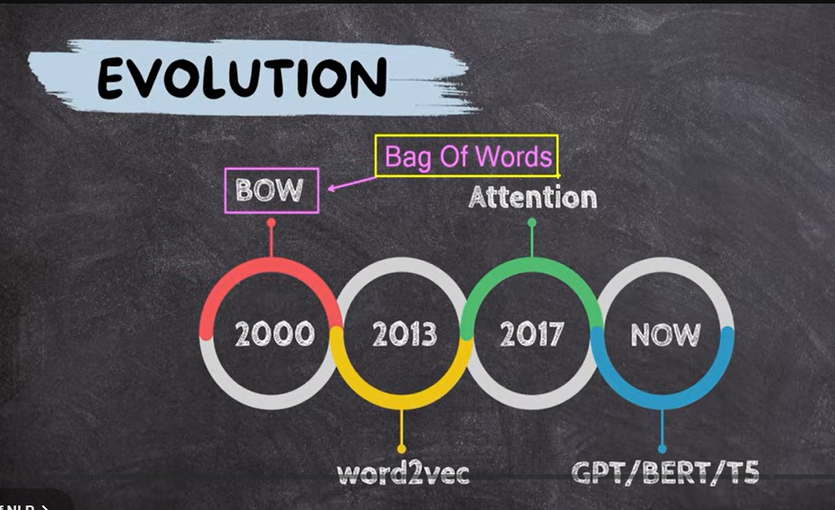

# Session 1

## Youtube Video 
  [Generative AI Full Course For Beginners (Data Domain Edition)](https://www.youtube.com/watch?v=9wNJ3IOfkHg)

-----------------------------

- What is AI?
Artificial intelligence (AI) is technology that enables computers and machines to simulate human-like abilities such as learning, reasoning, problem-solving, and decision-making.

- Language AI?  
Language AI refers to artificial intelligence systems focused on understanding, processing, and generating human language. It's a subset of AI often powered by natural language processing (NLP) and large language models (LLMs) like those behind chatbots and translation tools

- Evoluation AI

- BAG OF WORDS(BOG):  

 =  BoW is a text vectorization method where each unique word in the corpus becomes a feature (token).
 
  = It converts a sentence/document into numbers by counting word frequency.

  = Word order and grammar are ignored; only word presence/count matters.

  = Steps:

Collect text documents.
Create vocabulary (all unique words).
Count each vocabulary word per document.
Build a vector for every document.
Mini example:

D1: "I love data"
D2: "I love AI"

Vocabulary: [i, love, data, ai]

D1 vector: [1, 1, 1, 0]
D2 vector: [1, 1, 0, 1]

= Advantages:

> Simple, fast, easy to implement.
> Works well as a baseline model.

= Limitations:

> No context/meaning understanding.
> Large sparse vectors for big vocabularies.

= Common use cases:

> Spam detection
> Document classification
> Keyword-based text analytics

